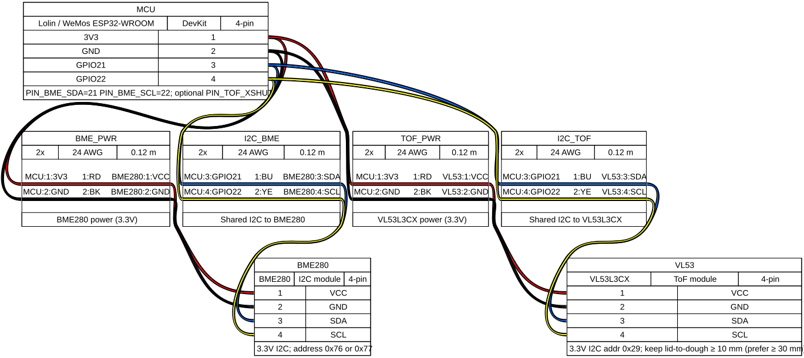

# Bench bring-up (ESP32 prototype)

Goal: USB-powered Lolin/WeMos ESP32-WROOM advertising BTHome so Home Assistant can discover temperature, humidity, and **ToF distance**.

## Wiring checklist

Follow [wiring.md](wiring.md) and the ESP32 assembly diagram:



Before powering USB:

1. BME280 VCC → 3V3, GND → GND, SDA → GPIO21, SCL → GPIO22
2. VL53L3CX VCC → 3V3, GND → GND, SDA → GPIO21, SCL → GPIO22 (same I2C bus)
3. Leave XSHUT pulled up / disconnected unless using `PIN_TOF_XSHUT`
4. Confirm the ToF aperture has a clear view into the jar and the dough surface stays **≥ 10 mm** away (prefer ≥ 30 mm)

## Flash and monitor

```bash
source .venv/bin/activate   # or ./scripts/setup_venv.sh
./scripts/bringup_esp32.sh
```

Expect serial lines like:

```text
temp=24.50C hum=55.20% press=1013.25hPa dist=120mm batt=100%
Advertising … bytes for 1500 ms
```

If ToF stays missing, check I2C scan output (addresses `0x76`/`0x77` and `0x29`) and that the aperture is not covered.

## Home Assistant

See [home-assistant.md](home-assistant.md). Distance is advertised in **millimetres** (BTHome); the MQTT republish automation converts to centimetres for sourd.io-style JSON.
