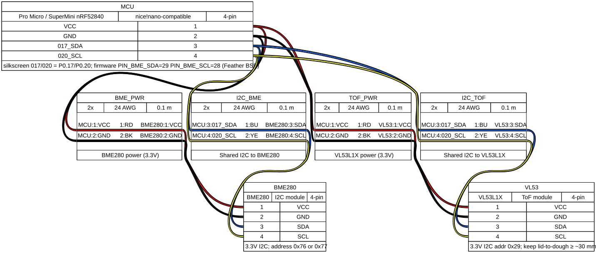

# Wiring

Assembly diagrams are generated with [WireViz](https://github.com/wireviz/WireViz) from YAML under [`wiring/`](wiring/). Regenerate with `./scripts/render_wiring.sh` (see [`wiring/README.md`](wiring/README.md)).

Pin tables below stay aligned with `PIN_*` in `firmware/platformio.ini`.

**Distance sensor:** VL53L1X ToF (I2C). Keep lid-to-dough clearance **≥ ~30–40 mm** including window/foam. Needs a clear optical path through the lid (not ultrasonic holes).

## Prototype — Lolin / WeMos ESP32-WROOM

| Signal        | ESP32 GPIO | Notes                                      |
|---------------|------------|--------------------------------------------|
| BME280 SDA    | 21         | Shared I2C; address `0x76` or `0x77`       |
| BME280 SCL    | 22         |                                            |
| BME280 VCC    | 3V3        |                                            |
| BME280 GND    | GND        |                                            |
| VL53L1X SDA   | 21         | Same bus; address `0x29`                   |
| VL53L1X SCL   | 22         |                                            |
| VL53L1X VCC   | 3V3        |                                            |
| VL53L1X GND   | GND        |                                            |
| VL53L1X XSHUT | (optional) | Active-low shutdown; leave pulled up if unused |

Override pins in `platformio.ini` `build_flags` (`PIN_BME_*`, optional `PIN_TOF_XSHUT`).

Bring-up steps: [bringup.md](bringup.md).

## Production — nRF52840

### Pro Micro / SuperMini (`env:nrf52840-promicro`)

nice!nano-compatible Pro Micro footprint (silkscreen `017` / `020` = P0.17 / P0.20).

| Signal        | Board pin     | Notes                                      |
|---------------|---------------|--------------------------------------------|
| Shared SDA    | 017 (P0.17)   | BME280 + VL53L1X; firmware `PIN_BME_SDA=29` (Feather BSP index) |
| Shared SCL    | 020 (P0.20)   | firmware `PIN_BME_SCL=28`                  |
| Both VCC      | VCC (3.3 V)   | Do not use RAW/5 V for sensors             |
| Both GND      | GND           |                                            |
| VL53L1X XSHUT | (optional)    | e.g. 022 (P0.22); firmware pin `30` if used |

### Adafruit Feather (`env:nrf52840`)

| Signal        | Feather pin | Notes                                      |
|---------------|-------------|--------------------------------------------|
| Shared SDA    | 25 (SDA)   | BME280/BMP280 + VL53L1X                    |
| Shared SCL    | 26 (SCL)   |                                            |
| Both VCC      | 3V3         |                                            |
| Both GND      | GND         |                                            |

### Seeed XIAO nRF52840 (`env:nrf52840-xiao`)

| Signal        | XIAO pin | Notes                          |
|---------------|----------|--------------------------------|
| Shared SDA    | D4 (SDA) | Confirm silkscreen on your rev |
| Shared SCL    | D5 (SCL) |                                |
| Both VCC      | 3V3      |                                |
| Both GND      | GND      |                                |

## Power

- Both sensors are **3.3 V only** — no 5 V rail or Echo divider.
- Optional `PIN_TOF_XSHUT` for hardware standby between samples (see [power.md](power.md)).
