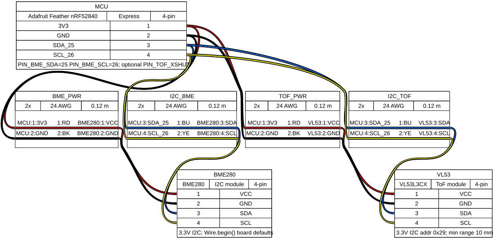
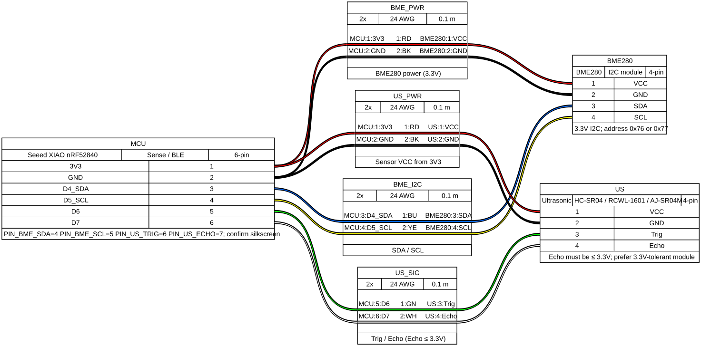

# Wiring

Assembly diagrams are generated with [WireViz](https://github.com/wireviz/WireViz) from YAML under [`wiring/`](wiring/). Regenerate with `./scripts/render_wiring.sh` (see [`wiring/README.md`](wiring/README.md)).

Pin tables below stay aligned with `PIN_*` in `firmware/platformio.ini`.

## Prototype — Lolin / WeMos ESP32-WROOM

| Signal        | ESP32 GPIO | Notes                                      |
|---------------|------------|--------------------------------------------|
| BME280 SDA    | 21         | 3.3V I2C; address `0x76` or `0x77`         |
| BME280 SCL    | 22         |                                            |
| BME280 VCC    | 3V3        |                                            |
| BME280 GND    | GND        |                                            |
| HC-SR04 VCC   | 5V         | Module expects 5V                          |
| HC-SR04 GND   | GND        |                                            |
| HC-SR04 Trig  | 25         | 3.3V OK out of ESP32                       |
| HC-SR04 Echo  | 26         | **Level-shift / divider to 3.3V**          |

Echo voltage divider (example): Echo → 2.2kΩ → GPIO26 → 4.7kΩ → GND.

Override pins in `platformio.ini` `build_flags` (`PIN_*`).

Bring-up steps: [bringup.md](bringup.md).

## Production — nRF52840

### Adafruit Feather (`env:nrf52840`)

| Signal        | Feather pin | Notes                                      |
|---------------|-------------|--------------------------------------------|
| BME280 SDA    | 25 (SDA)   | Board defaults; Wire.begin()               |
| BME280 SCL    | 26 (SCL)   |                                            |
| HC-SR04 Trig  | 27          | Adjust to free GPIOs on your board         |
| HC-SR04 Echo  | 7           | Must be ≤ 3.3V                             |
| HC-SR04 VCC   | MOSFET out  | Optional `PIN_US_PWR` gate (see power.md)  |

### Seeed XIAO nRF52840 (`env:nrf52840-xiao`)

| Signal        | XIAO pin | Notes                          |
|---------------|----------|--------------------------------|
| BME280 SDA    | D4 (SDA) | Confirm silkscreen on your rev |
| BME280 SCL    | D5 (SCL) |                                |
| HC-SR04 Trig  | D6       | Free GPIO                      |
| HC-SR04 Echo  | D7       | Must be ≤ 3.3V                 |

nRF52840 has no 5V rail. Options:

1. Use a **3.3V-tolerant HC-SR04** / RCWL-1601 / AJ-SR04M in 3.3V mode.
2. Or a small boost to 5V for the module + **divider on Echo** (never feed 5V into GPIO).

## Power

- ESP32 DevKit: USB for bring-up. Deep sleep works, but board quiescent current is high — not a battery reference.
- nRF52840 + LiPo: intended battery path. Sample every 90s (configurable via `SAMPLE_INTERVAL_SEC`).
